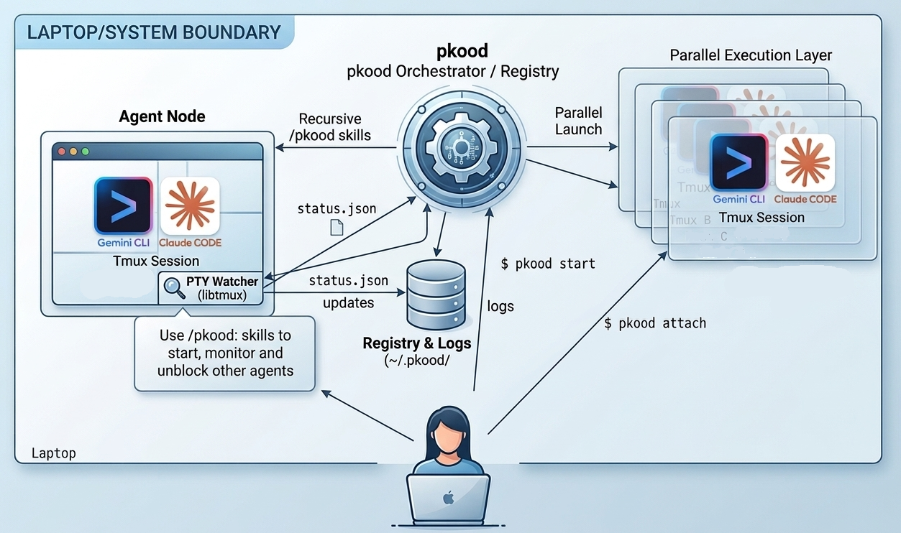

# Pkood <small>(said like 'groot')<small>



Run tens of agent sessions (Claude-code / Gemini-CLI / Antigravity) in parallel. Monitor them, attach to them, and analyze their internal thought logs. Get notified when they are blocked and await your input.

## Installation

1. **Requirements**: 
   - Python 3.10+
   - `tmux` (Required for managed background sessions. Available via `brew install tmux` on macOS or `sudo apt install tmux` on Linux/Windows:WSL2).

2. **Install via PyPI**:
   ```bash
   pip install pkood
   ```

3. **Install from Source**:
   Clone the repository and install in editable mode:
   ```bash
   git clone https://github.com/tal-franji/pkood.git
   cd pkood
   pip install -e .
   ```

4. **Verify and Configure**:
   Run the system check to ensure requirements are installed and to automatically configure your AI agents (Gemini CLI / Claude Code) to talk to the Pkood control plane:
   ```bash
   pkood test
   ```

## Operation

Pkood treats AI agents and long-running tasks as managed services. It also automatically discovers independent agents (like Antigravity or raw CLI sessions) running on your system.

### Commands

- **Start an interactive session**:
  Creates a new session running your default shell or a specified CLI agent in the given directory and attaches to it immediately.
  ```bash
  pkood start --dir ./my-project --cmd claude
  ```
  *Options:*
  * `--cmd <agent>`: Specify the CLI command to launch (e.g., 'gemini', 'claude'). If omitted, Pkood will auto-detect or fall back to your shell.
  * `--name <name>`: Custom session name (defaults to directory name).
  * `--fg`: Foreground - Runs the agent natively in your current terminal (without Tmux). Pkood will still track its logs and status, but you cannot remotely attach/inject into it.

- **Spawn a background agent**:
  Runs a specific command in a managed background session.
  ```bash
  pkood spawn --name research-task "gemini 'research the latest AgOps trends'"
  ```

- **List active agents**:
  Shows all agents, their current status (RUNNING, IDLE, BLOCKED, EXITED, or DETACH), standard I/O log size, and internal history size.
  ```bash
  pkood ls
  ```
  *Note: Agents in `DETACH` mode are independent processes (like Antigravity) discovered via system heuristics.*

- **View Thinking History**:
  Tails the internal thought/chat log of an agent (as opposed to its terminal standard I/O).
  ```bash
  pkood hist research-task -n 100
  ```

- **Attach to a session**:
  Join a running agent's terminal (Managed agents only).
  ```bash
  pkood attach research-task
  ```
  *To detach without killing the agent, press `Ctrl+B` then `D`.*

- **Kill an agent**:
  Terminates the session and cleans up associated sockets and state files.
  ```bash
  pkood kill research-task
  ```

- **Inject input**:
  Send text directly to a background agent's terminal (Managed agents only).
  ```bash
  pkood inject research-task "y"
  ```

### Key Shortcuts (within a session)
After attaching to a managed session, you can use the following Tmux keys:

- **Detach**: `Ctrl+B` followed by `D`
- **Scroll Mode**: `Ctrl+B` followed by `[` (Press `q` to exit)
- **Force Exit**: `Ctrl+D` (This kills the agent and closes the session)

## Skills and Slash Commands

Pkood can install skills and slash commands for AI agents (Gemini CLI / Claude Code) to allow them to interact with the Pkood control plane.

### Install Skills and Slash Commands

```bash
pkood test
```

### Use the Skills and Slash Commands
Pkood installs custom slash commands into your AI CLI to make fleet management seamless.

*   **View Fleet Status:** Show all active agents, their status, and an intelligent summary synthesized from both terminal output and internal thought logs.
    ```bash
    /pkood:status
    ```
*   **Review and Unblock:** Triage all currently blocked managed agents in a single step, presenting a numbered list of pending actions for batch approval.
    ```bash
    /pkood:review
    ```
*   **Auto Review and Unblock:** Automatically act as a Fleet Manager to triage blocked agents. Approves actions that are not obviously dangerous or large refactoring.
    ```bash
    /pkood:auto
    ```
*   **Spawn a Sub-Agent:** Instruct your current agent to act as a Fleet Manager, parse your request, and spawn a new background agent to handle the task autonomously.
    ```bash
    /pkood:start
    Write a Python script that finds the first 4 perfect numbers.
    ```

## The AgOps Control Plane (MCP)
This is the internal service used by the skills and slash commands. You do not need to use it directly.

Pkood includes a built-in **Model Context Protocol (MCP)** server. This transforms Pkood from a simple CLI tool into an orchestration layer that your AI agents can use to manage each other.

### Starting the Control Plane
To allow agents to see and interact with the fleet, start the MCP service:
```bash
pkood mcp
```
*(Runs on `http://localhost:8000/sse` by default)*

### What Agents Can Do
Once your agents (like Gemini CLI or Claude Code) are connected to the Pkood MCP, they gain "fleet awareness." They can use the following tools:
- **`list_agents`**: See the full state of the system.
- **`tail_agents`**: Read the standard I/O (terminal output) of managed agents.
- **`hist_agents`**: Read the internal thinking/history logs of any discovered agent.
- **`inject_to_agent`**: Remotely unblock managed agents.
- **`format_status_table`**: Generate a consistent, human-readable fleet dashboard.

By exposing both the mechanical terminal primitives and the semantic internal logs as structured MCP tools, Pkood enables a recursive, multi-agent development workflow where one "Manager" agent can coordinate a fleet of specialized workers.

## Comparison: Pkood vs. Claude `/batch`

While Claude Code's `/batch` skill is excellent for quick, sequential automation, Pkood is designed for long-running, autonomous operations and IDE-based development.

| Feature | Claude `/batch` | Pkood |
| :--- | :--- | :--- |
| **Persistence** | Ephemeral (stops if terminal closes) | **Persistent** (background or system-detached) |
| **Visibility** | Simple progress status | **Full Terminal Attachment** + **Internal Thought Analysis** |
| **Context** | Single-session focus | **Fleet-wide awareness** via MCP |
| **Control** | Stop/Start only | **Inject input**, search logs, and manage state |
| **Hybrid Workflow** | Terminal only | **Unifies IDE (Antigravity) and CLI agents** |

**Use `/batch`** when you want to automate 10 small local edits in your current session.

**Use Pkood** when you want to run a fleet of independent agents that work autonomously across different projects and require high-level coordination and observability.

## Comparison: Pkood vs. Claude Desktop
Claude Desktop app allow nice UI to moving between terminal sessions and some may find them more convenient than working with `tmux` sessions. However Claude Desktop does not allow one agent to reason about other agents output and thought-process.

